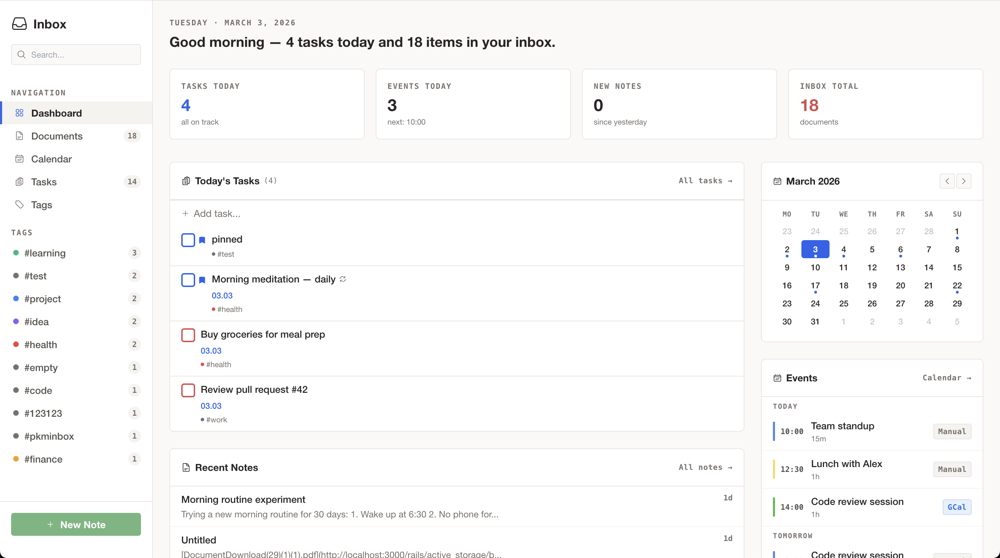
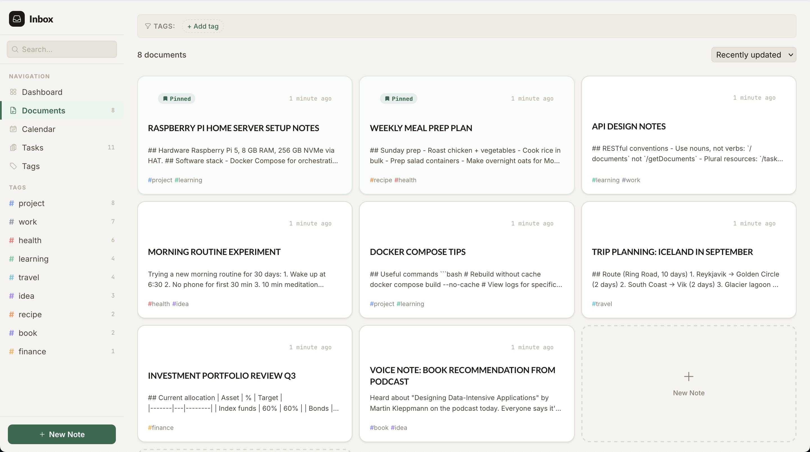
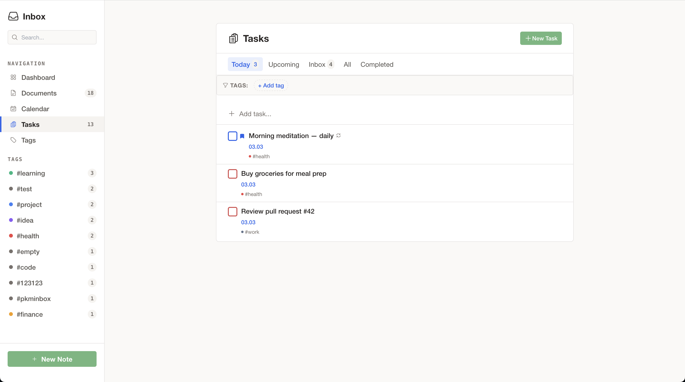
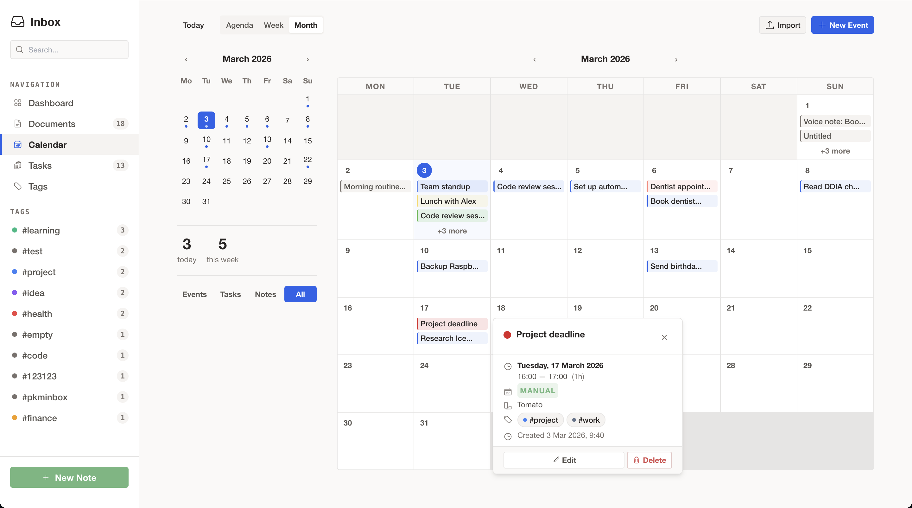

# Inbox

A privacy-first personal note-taking system with Telegram bot integration, voice transcription, and calendar sync. Runs on a Raspberry Pi — no cloud required.

[](LICENSE)

## Why

We live in an interesting time when producing code has become incredibly cheap. You can vibe-code any solution and solve your problem. This project is my personal answer to the shortcomings of modern information capture and storage systems. My current setup is a home server running on a Raspberry Pi where I keep all my notes. I have tried plenty of tools — Evernote, Obsidian, and others. They are great products, but I wanted more flexibility for my specific workflows. So I vibe-coded my own. If it turns out to be useful for someone else, I will consider the world a tiny bit better.

## Features

- **Telegram Bot** -- capture notes, voice messages, photos, and files from Telegram
- **Voice Transcription** -- local audio-to-text via [Parakeet v3](https://huggingface.co/nvidia/parakeet-tdt-0.6b-v3) (no cloud API, 25 languages)
- **Audio Recording** -- record voice notes directly in the browser, auto-transcribed
- **Cloud Storage** -- optionally store files and backups on S3, Dropbox, Google Drive, or OneDrive
- **Google Calendar Sync** -- import events and get reminders via Telegram
- **Tags** -- organize documents and tasks with a flexible tagging system
- **Tasks** -- simple task management with due dates
- **Markdown Editor** -- write and preview Markdown with live toggle
- **Search** -- full-text search across all documents
- **Privacy** -- everything stays on your hardware, single-user design

## Screenshots

|                  Dashboard                   |                  Documents                   |
| :------------------------------------------: | :------------------------------------------: |
|  |  |

|                Tasks                 |                  Calendar                  |
| :----------------------------------: | :----------------------------------------: |
|  |  |

## Tech Stack

| Component       | Technology                            |
| --------------- | ------------------------------------- |
| Backend         | Ruby on Rails 8.1                     |
| Database        | SQLite3                               |
| Frontend        | Stimulus.js, Tailwind CSS             |
| Asset Pipeline  | Propshaft, esbuild, cssbundling-rails |
| Background Jobs | SolidQueue / Sidekiq                  |
| Transcription   | Parakeet v3 / onnx-asr (Python)       |
| Containers      | Docker Compose                        |
| Testing         | RSpec, FactoryBot, SimpleCov          |

## Quick Start (Docker)

### Prerequisites

- Docker and Docker Compose
- A Telegram bot token (from [@BotFather](https://t.me/BotFather))

### 1. Clone and configure

```bash
git clone https://github.com/yourusername/inbox.git
cd inbox

# Create environment file
cp .env.example .env
```

Edit `.env` and fill in your values:

```dotenv
SECRET_KEY_BASE=$(openssl rand -hex 64)
TELEGRAM_BOT_TOKEN=your_bot_token_from_botfather
TELEGRAM_BOT_NAME=your_bot_name
TELEGRAM_ALLOWED_USER_ID=your_telegram_user_id
TELEGRAM_WEBHOOK_URL=https://your-domain.com/api/telegram/webhook
```

> **Tip:** To find your Telegram user ID, send a message to [@userinfobot](https://t.me/userinfobot).

### 2. Set up Docker secrets

```bash
mkdir -p secrets
echo "your_bot_token" > secrets/telegram_bot_token
openssl rand -hex 32 > secrets/telegram_webhook_secret_token
chmod 600 secrets/*
```

### 3. Build and start

```bash
docker compose build
docker compose run --rm web bin/rails db:create db:migrate
docker compose up -d
```

### 4. Register Telegram webhook

```bash
BOT_TOKEN=$(cat secrets/telegram_bot_token)
SECRET_TOKEN=$(cat secrets/telegram_webhook_secret_token)

curl -X POST "https://api.telegram.org/bot${BOT_TOKEN}/setWebhook" \
  -H "Content-Type: application/json" \
  -d "{\"url\": \"https://your-domain.com/api/telegram/webhook\", \"secret_token\": \"${SECRET_TOKEN}\"}"
```

### 5. Open the app

Navigate to `http://localhost:3000` (or your domain if deployed).

## Development Setup

### Prerequisites

- Ruby 3.3+ (via [asdf](https://asdf-vm.com/), rbenv, or rvm)
- Node.js 22+
- pnpm
- SQLite3 3.43+

### Setup

```bash
# Install dependencies
bundle install
pnpm install

# Setup database
bin/rails db:create db:migrate db:seed

# Build assets
pnpm run build
pnpm run build:css

# Start development server
bin/dev
```

### Running Tests

```bash
bundle exec rspec              # Full test suite
bin/rubocop                    # Code style
bin/brakeman --no-pager        # Security scan
```

## Environment Variables

| Variable                     | Required | Description                                                    |
| ---------------------------- | -------- | -------------------------------------------------------------- |
| `SECRET_KEY_BASE`            | Yes      | Rails secret key (generate with `openssl rand -hex 64`)        |
| `TELEGRAM_BOT_TOKEN`         | Yes      | Bot token from BotFather                                       |
| `TELEGRAM_BOT_NAME`          | Yes      | Bot username (without @)                                       |
| `TELEGRAM_ALLOWED_USER_ID`   | Yes      | Your Telegram user ID                                          |
| `TELEGRAM_WEBHOOK_URL`       | Yes      | Public URL for webhook                                         |
| `API_TOKEN`                  | No       | Token for API authentication                                   |
| `GIT_SHA`                    | No       | Git commit SHA, baked at build time for version tracking       |
| `TRANSCRIBER_URL`            | No       | Transcription service URL (default: `http://transcriber:5000`) |
| `TRANSCRIBER_LANGUAGE`       | No       | Force transcription language (default: auto-detect)            |
| `GOOGLE_CLIENT_ID`           | No       | For Google Calendar sync                                       |
| `GOOGLE_CLIENT_SECRET`       | No       | For Google Calendar sync                                       |
| `GOOGLE_REFRESH_TOKEN`       | No       | For Google Calendar sync                                       |
| `GOOGLE_CALENDAR_IDS`        | No       | Comma-separated calendar IDs (default: `primary`)              |
| `DROPBOX_CLIENT_ID`          | No       | Dropbox OAuth app key (for Dropbox storage)                    |
| `DROPBOX_CLIENT_SECRET`      | No       | Dropbox OAuth app secret                                       |
| `GOOGLE_DRIVE_CLIENT_ID`     | No       | Google Drive OAuth client ID                                   |
| `GOOGLE_DRIVE_CLIENT_SECRET` | No       | Google Drive OAuth client secret                               |
| `ONEDRIVE_CLIENT_ID`         | No       | Microsoft OneDrive/Graph OAuth client ID                       |
| `ONEDRIVE_CLIENT_SECRET`     | No       | Microsoft OneDrive/Graph OAuth client secret                   |
| `BACKUP_STORAGE_TYPE`        | No       | **Deprecated** — use Settings > Storage instead                |
| `BACKUP_LOCAL_PATH`          | No       | **Deprecated** — use Settings > Storage instead                |
| `BACKUP_RETENTION_DAYS`      | No       | Days to keep backups (default: 30)                             |
| `BACKUP_S3_BUCKET`           | No       | **Deprecated** — use Settings > Storage instead                |
| `BACKUP_S3_ACCESS_KEY`       | No       | **Deprecated** — use Settings > Storage instead                |
| `BACKUP_S3_SECRET_KEY`       | No       | **Deprecated** — use Settings > Storage instead                |
| `BACKUP_S3_REGION`           | No       | **Deprecated** — use Settings > Storage instead                |
| `BACKUP_S3_ENDPOINT`         | No       | **Deprecated** — use Settings > Storage instead                |

## Cloud Storage

By default, all files and backups are stored locally on disk. You can optionally connect a cloud storage provider (S3, Dropbox, Google Drive, or OneDrive) through **Settings > Storage** in the web UI.

### S3 / S3-Compatible (MinIO, Backblaze B2)

1. Go to **Settings > Storage**, select **S3**
2. Enter your access key, secret, region, and bucket name
3. For S3-compatible services (MinIO, Backblaze B2), also fill in the **Endpoint** field
4. Click **Save Settings**, then **Test Connection**

### Dropbox

1. Create an app at [Dropbox App Console](https://www.dropbox.com/developers/apps):
   - Choose "Scoped access" and "Full Dropbox" access type
   - Under Permissions, enable `files.metadata.read`, `files.metadata.write`, `files.content.read`, `files.content.write`
   - Add `https://your-domain.com/settings/storage/oauth/dropbox/callback` as a redirect URI
2. Set `DROPBOX_CLIENT_ID` and `DROPBOX_CLIENT_SECRET` ENV vars (from the app's Settings page)
3. Go to **Settings > Storage**, select **Dropbox**, click **Connect Dropbox**
4. Authorize in the Dropbox consent screen — files will be stored under `Apps/Inbox/`

### Google Drive

1. Create an OAuth 2.0 client at [Google Cloud Console](https://console.cloud.google.com/apis/credentials):
   - Enable the **Google Drive API**
   - Create an OAuth client (Web application type)
   - Add `https://your-domain.com/settings/storage/oauth/google_drive/callback` as an authorized redirect URI
2. Set `GOOGLE_DRIVE_CLIENT_ID` and `GOOGLE_DRIVE_CLIENT_SECRET` ENV vars
3. Go to **Settings > Storage**, select **Google Drive**, click **Connect Google Drive**
4. Authorize in the Google consent screen — files will be stored under an `Inbox/` folder in your Drive

### OneDrive

1. Register an app at [Azure App Registrations](https://portal.azure.com/#blade/Microsoft_AAD_RegisteredApps):
   - Add `https://your-domain.com/settings/storage/oauth/onedrive/callback` as a redirect URI (Web platform)
   - Under API permissions, add `Files.ReadWrite` (Microsoft Graph, delegated)
   - Create a client secret under Certificates & secrets
2. Set `ONEDRIVE_CLIENT_ID` (Application/client ID) and `ONEDRIVE_CLIENT_SECRET` ENV vars
3. Go to **Settings > Storage**, select **Onedrive**, click **Connect Onedrive**
4. Authorize in the Microsoft consent screen — files will be stored under `Apps/Inbox/`

### Migrating Files

When switching from local to a cloud provider, go to **Settings > Storage** and click **Migrate Files**. This runs a background job that copies all existing files and backups to the new provider. Progress is shown on the settings page.

## How It Works

Inbox collects information from multiple sources, processes it in the background, and presents everything through a clean web interface.

```
┌─────────────────────┐   ┌─────────────────────┐   ┌─────────────────────┐
│    Telegram Bot      │   │   Google Calendar     │   │    Web Editor        │
│  text / voice / files│   │   OAuth / RPi sync   │   │  web / quick capture │
└─────────┬───────────┘   └─────────┬───────────┘   └─────────┬───────────┘
          │                         │                          │
          ▼                         ▼                          ▼
┌─────────────────────┐   ┌─────────────────────┐   ┌─────────────────────┐
│      Webhook         │   │    GCal Sync Job     │   │   Rails Controller   │
│  POST /api/telegram  │   │   Sidekiq / cron     │   │   Form / Turbo       │
└─────────┬───────────┘   └─────────┬───────────┘   └─────────┬───────────┘
          │                         │                          │
          └────────────┬────────────┘──────────────────────────┘
                       ▼
          ┌───────────────────────┐
          │     SQLite Database    │
          │  documents · tasks     │
          │  calendar_events · tags │
          └───────────┬───────────┘
                      │
        ┌─────────────┼─────────────┐
        ▼             ▼             ▼
┌──────────────┐ ┌──────────┐ ┌──────────┐
│  Parakeet v3  │ │  Redis   │ │  Google   │
│ Transcription │ │  Cache   │ │ Cal API  │
│ (local, CPU)  │ │ + Queue  │ │ (OAuth)  │
└──────────────┘ └──────────┘ └──────────┘
```

### Data Flow

1. **Capture** -- Send a text message, voice note, photo, or file to your Telegram bot. Type directly in the web editor, or record audio from the browser.
2. **Process** -- Voice messages are transcribed locally by Parakeet v3 with automatic punctuation and capitalization. All messages are saved as notes.
3. **Store** -- Everything lands in SQLite as a document with Markdown content. Tasks get due dates and priorities. Calendar events sync from Google.
4. **Organize** — Tag documents and tasks. Pin important notes. Filter by source, tag, or date.
5. **Access** — Browse, search, and edit from any device through the web UI. Protected by HTTP Basic Auth over HTTPS.

## Deployment

For production deployment on a Raspberry Pi with Docker Compose, nginx, and WireGuard VPN, see the [Deployment Quickstart](.project/deployment-quickstart.md).

## Contributing

See [CONTRIBUTING.md](CONTRIBUTING.md) for development setup, code style, and PR guidelines.

## License

This project is licensed under the MIT License — see the [LICENSE](LICENSE) file for details.

## Support the project

If you find Inbox useful, consider supporting development via GitHub Sponsors.
